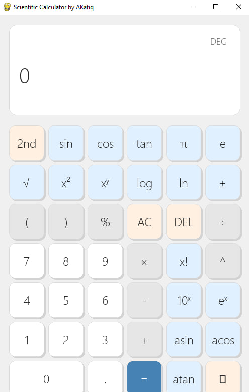

## Scientific Calculator by AKafiq

A modern, responsive scientific calculator built with Python and Pygame. This project showcases a clean user interface, handles basic and scientific operations, and adapts to different window sizes.

### ✨ **Features**

  * **Responsive UI:** The calculator layout and display automatically scale to fit the window size.
  * **Scientific Functions:** Includes trigonometric functions (sin, cos, tan), logarithmic functions (log, ln), square root, exponentiation, and factorial.
  * **Operator Precedence:** Correctly evaluates expressions with multiple operators.
  * **History Log:** Keeps a record of recent calculations for easy reference.
  * **Light & Dark Themes:** Switch between different color schemes for a personalized experience.
  * **User-Friendly Controls:** Supports both mouse clicks and keyboard input for numbers and operators.

### 🚀 **Installation & Setup**

#### Option 1: Using the Standalone Executable

1.  Go to the **[Releases page](https://github.com/AfiqIrsyad01/ak-sci-calc/releases)** of this repository.
2.  Download the `.zip` file for the latest release.
3.  Unzip the file and launch the `ScientificCalculator.exe` to use the application without any installation.

#### Option 2: Running from Source

1.  **Clone the repository:**
    ```bash
    git clone https://github.com/AfiqIrsyad01/ak-sci-calc.git
    cd ak-sci-calc
    ```
2.  **Install the dependencies:**
    This project requires **Pygame**. You can install it using pip:
    ```bash
    pip install pygame
    ```
3.  **Run the application:**
    ```bash
    python calculator.py
    ```

### 💻 **Usage**

  * **Numbers & Operators:** Click the buttons on the screen or use your keyboard to input numbers and operators.
  * **Scientific Functions:** The `2nd` button toggles between standard and inverse trigonometric functions.
  * **Theme Toggle:** Click the ☀️ button to switch between light and dark modes.
  * **History:** The top of the display shows a history of your previous calculation.


